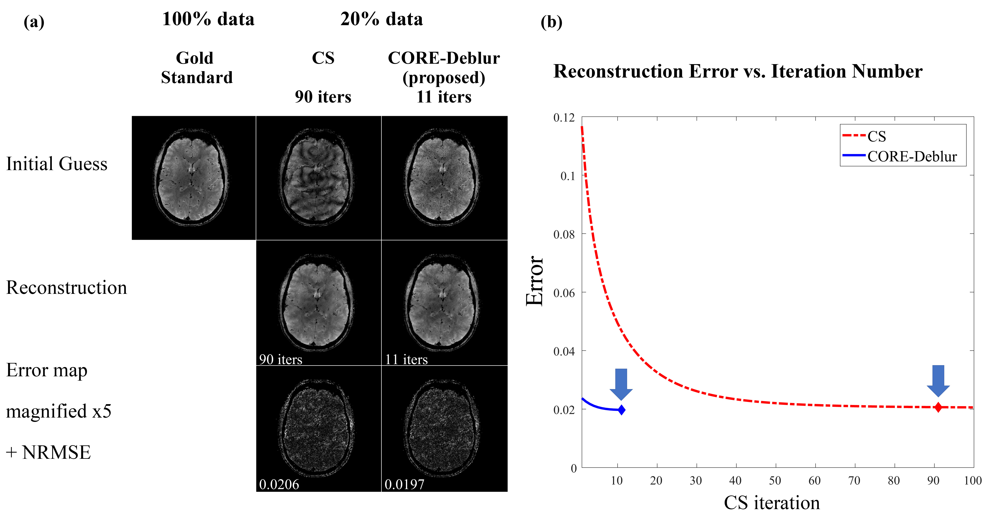

-----------------------------------------------------------------------------------
A Matlab toolbox for CORE-Deblur
----------------------------------------------------------------------------------

CORE-Deblur is a Parallel Imaging + Compressed Sensing (PI+CS) method. **CORE-Deblur enables reducing the number of Compressed Sensing iterations by a factor of 10.**

Paper:
     [CORE-Deblur: Parallel MRI Reconstruction by Deblurring Using Compressed Sensing"](https://arxiv.org/abs/2004.01147)

This toolbox contains Matlab code that implements CORE-Deblur.
Examples are provided using simulated phantom data and and in-vivo 7T brain data.

## Getting Started
Clone or download the code.

To see the demos run one of these Matlab scripts:

#### In-vivo demos ####
[**demo1_in_vivo**](demo1_in_vivo.m) - this code includes two examples with in-vivo 32-coils 7T brain data and subsampling with a reduction factor of R=4.

Inside the code, set the following flag:
demo = 'In_vivo_example_1';

Then run, and you will get figures similar to these:

 
 
 
 
 
 
 

#### Brain phantom demos ####
[**demo2_brain_phantom**](demo2_brain_phantom.m) - this code includes four examples with simulated brain phantom data and subsampling with a reduction factor of R=10.

Run the code and you will reproduce the results from this figure:

## Acknowledgments
The in-vivo data is courtesy of Prof. Andrew G. Webb from Leiden University Medical Center (LUMC).

The Realistic Analytical Brain Phantom data was utilized here with permission from
the authors of:
    Guerquin-Kern, Matthieu, et al. "Realistic analytical phantoms for parallel
    magnetic resonance imaging." IEEE Transactions on Medical Imaging 31.3
    (2011): 626-636.
If you use that data in your publications, please cite this paper.

## Prerequisites
A liscence for Matlab is required. The code was tested with Matlab2017R.
